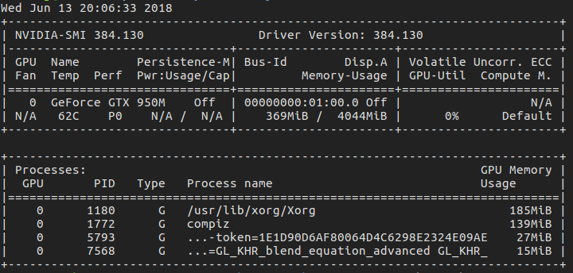
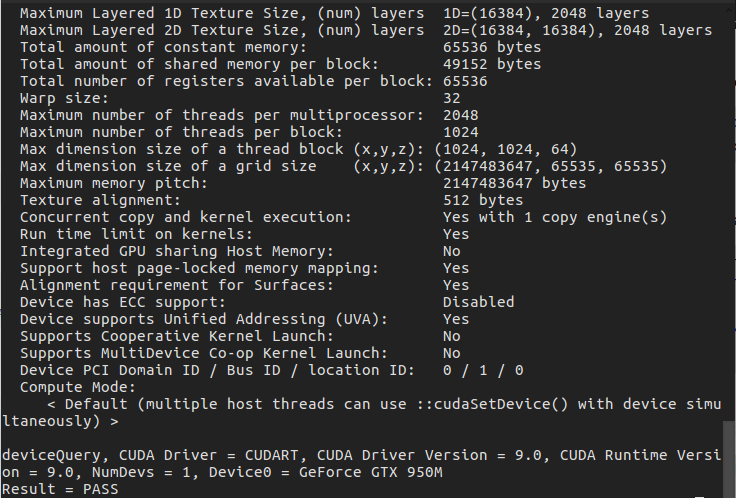
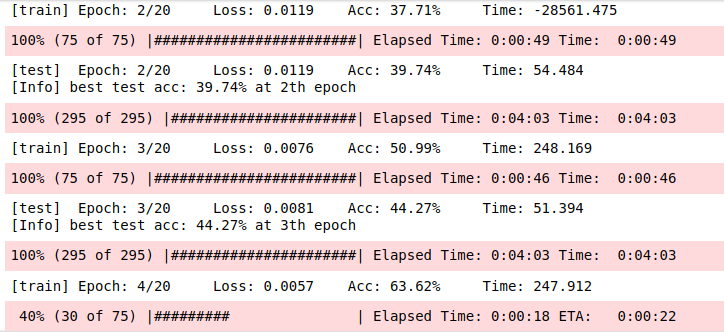
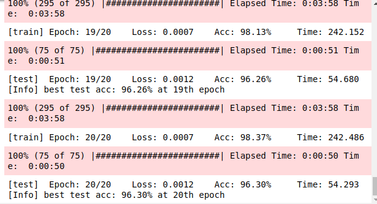
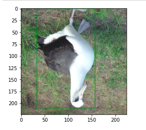
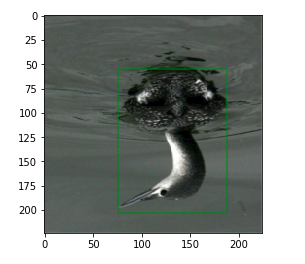
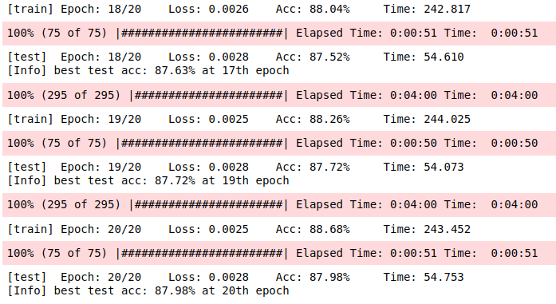
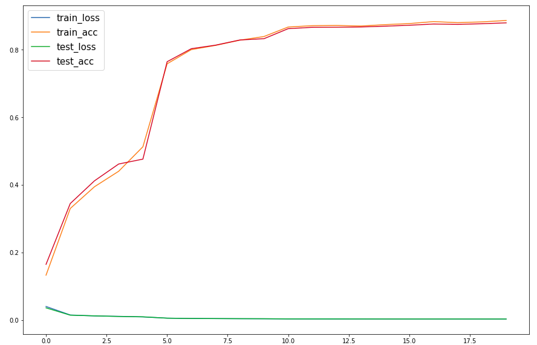
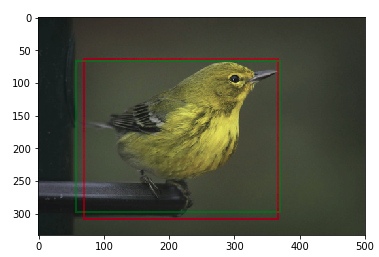

# Lab 3 Deep Learning using Pytorch 
| student ID | name   |
| ---------- | ------ |
| 3150103457 | 邓墨琳 |

## Environments

* Ubuntu 16.04 LTS

* Nvidia-384.130

  * Install some independences

  ```shell
  $> sudo apt-get install libprotobuf-dev libleveldb-dev libsnappy-dev libopencv-dev libhdf5-serial-dev protobuf-compiler
  $> sudo apt-get install --no-install-recommends libboost-all-dev
  $> sudo apt-get install libopenblas-dev liblapack-dev libatlas-base-dev
  $> sudo apt-get install libgflags-dev libgoogle-glog-dev liblmdb-dev
  ```

  * Install Nvidia Driver

  ```shell
  $> sudo apt-get remove --purge nvidia*
  $> sudo apt-get update
  ```
  > CTRL+ALT+F1

  ```shell
  $> sudo service lightdm stop
  $> sudo apt-get install nvidia-384
  $> nvidia-smi
  ```
  	

* CUDA 9.0

  Download .run from Web

  ```shell
  $> sudo chmod a+u xxxx.run #x is what u download
  $> sudo ./xxxx.run
  ```

  Configure Path Variable

  ```shell
  $> sudo vim ~/.bsharc #:wq
  ```

  ```shell
  export PATH=/usr/local/cuda-9.0/bin:$PATH
  export LD_LIBRARY_PATH=/usr/local/cuda9.0/lib64:$LD_LIBRARY_PATH
  ```

  * Test example

    ```shel
    cd /usr/local/cuda-9.0/samples/1_Utilities/deviceQuery
    sudo make
    sudo ./deviceQuery
    ```

    

* cudnn 7

* Pytorch 0.4.0 

  ```shell
  $> sudo pip3 install http://download.pytorch.org/whl/cu90/torch-0.4.0-cp35-cp35m-linux_x86_64.whl # maybe use python3 -m pip ...
  $> sudo pip3 install torchvision
  ```

* Test for CUDA & CUDNN

  ```python
  # CUDA TEST
  import torch
  x = torch.Tensor([1.0])
  xx = x.cuda()
  print(xx)
  
  # CUDNN TEST
  from torch.backends import cudnn
  print(cudnn.is_acceptable(xx))# True
  ```

## Run the example

```shell
$> jupyter notebook visualize.ipynb
```



**The final accuracy for test data is 96.48%**, How can I optimize the final result?

## Some Considerations for Optimization

### I. Change the model

```python
model = models.resnet34(pretrained=True)
fc_in_size = model.fc.in_features
model.fc = nn.Linear(fc_in_size, 4)
```

Change ResNet18 to ResNet34 with the naive experience that the **DEEPER** the network is, the **BETTER** accuracy the result gets. I spent about twice time finishing training, and merely got the disappointing result with **accuracy 96.49%**.

### II. Adding more training data

We can do this by changing data split ratio

```python
train_id, test_id = split(0.1)# or less
```

But compared with the original amount of training data, this increment can be omitted. And for sure dose little influence on the result.

What we need is more birds images.

### III. Data augmentation

#### Apply RandomGrayscale to training data

```python
if im_ids == train_id:
    self.transform = transforms.Compose([
        transforms.Resize((224,224)),
        transforms.RandomGrayscale(0.2),
        transforms.ToTensor(),
        transforms.Normalize([0.485, 0.456, 0.406], [0.229, 0.224, 0.225])
    ])
    else:
        self.transform = transforms.Compose([
            transforms.Resize((224,224)),
            transforms.ToTensor(),
            transforms.Normalize([0.485, 0.456, 0.406], [0.229, 0.224, 0.225])
        ])
```

The final result is 96.30% at 20th epoch. **No improvement**.



#### RandomVerticalFlip or RandomHorizontalFlip

First I changed the CUBDataset class to let the TRANSFORM method also applies to bounding boxes. Because when I flip the image, the bounding box should be flipped at the same time in the same way.

```python
# In class CUBDataset
def __getitem__(self, index):
    ...
    sample = {'image': im, 'box': box}
    sample = self.transform(sample)
    return sample['image'], sample['box'], im_size
```

Then I defined my own transformation classes(function)

```python
class MyResize(object):
    def __init__(self, output_size):
        assert isinstance(output_size, (int, tuple))
        self.output_size = output_size
    def __call__(self, sample):
        image, box = sample['image'], sample['box']
        return {'image':transforms.Resize(self.output_size)(image), 'box':box}
    
class MyToTensor(object):
    def __call__(self, sample):
        image, box = sample['image'], sample['box']
        return {'image': transforms.ToTensor()(image), 'box': box}
    
class MyNormalize(object):
    def __init__(self, mean, std):
        self.mean = mean
        self.std = std
    def __call__(self, sample):
        image, box = sample['image'], sample['box']
        return {'image': transforms.Normalize(self.mean, self.std)(image), 'box': box}

class MyRandomVerticalFlip(object):
    def __init__(self, p=0.5):
        self.p = p
    def __call__(self, sample):
        image, box = sample['image'], sample['box']
        if random.random() < self.p:
            im_size = np.array(image.size, dtype='float32')
            box[1] = im_size[1] - (box[1] + box[3])
            return {'image': image.transpose(Image.FLIP_TOP_BOTTOM), 'box':box}
        return {'image':image, 'box':box}
    
class MyRandomHorizontalFlip(object):
    def __init__(self, p=0.5):
        self.p = p
    def __call__(self, sample):
        image, box = sample['image'], sample['box']
        if random.random() < self.p:
            im_size = np.array(image.size, dtype='float32')
            box[0] = im_size[0] - (box[0] + box[2])
            return {'image':image.transpose(Image.FLIP_LEFT_RIGHT),'box':box}
        return {'image':image, 'box':box}
   
class MyRandomGrayscale(object):
    def __init__(self, p=0.1):
        self.p = p
    def __call__(self, sample):
        image, box = sample['image'], sample['box']
        if random.random() < self.p:
            return {'image':transforms.RandomGrayscale(self.p)(image),'box':box}
        return {'image':image, 'box':box}
```

And in CUBDataset class, we can define transforms.Compose function

```python 
if transform is None:
    if im_ids == train_id:
        self.transform = transforms.Compose([
            MyRandomVerticalFlip(),
            MyRandomHorizontalFlip(),
            MyResize((224,224)),
            MyRandomGrayscale(),
            MyToTensor(),
            MyNormalize([0.485, 0.456, 0.406], [0.229, 0.224, 0.225])
        ])
        else:
            self.transform = transforms.Compose([
                MyResize((224,224)),
                MyToTensor(),
                MyNormalize([0.485, 0.456, 0.406], [0.229, 0.224, 0.225])
```

We can got flipped training images with accuracy box position&size or even gray images(with 3 channels)





I did not consider the rotation, because it requires more data(different data) about bounding boxes, which is not provided in the files. 







The result is 87.98% without any improvement, but from the figure, we can see that the test accuracy is much more closer to train accuracy, compared with the no extra transformation to dataset, seen as below.


I think there are two main reasons for no improvement.

* The original data set is well defined, other part such as model details, learning rate and so on, should be modified carefully.
* After image transformation, the original image should also be kept in the dataset, instead of being replaced by the changed image.

## 感悟

这次深度学习框架Pytorch的实践，收获颇多。

* 了解了torchvision中datasets、transforms、models相关接口的使用和相关类的定义方法，通过修改CUBDataset类可以实现image和bounding box的同时修改或变换。
* 可以将自己定义的关于数据集的变换函数定义成类，通过transforms.Compose接口实现他们的组合变换，来达到数据增强的目的，如Some Considerations for Optimization中所简要描述的，虽然掌握程度有限，但这是一次不错的尝试。
* 深度学习的结果好坏与许多方面有关，比如模型结构、优化方法、数据预处理、数据增强等等。使用哪种模型、哪种算法、哪种数据处理方法要根据具体问题而定，对于特定问题往往有数据和操作上的经验，需要我们从项目不断积累。比如ResNet用于Image Classification，而过去常使用LeNet做手写体的识别等等。
* 官方文档非常有帮助.