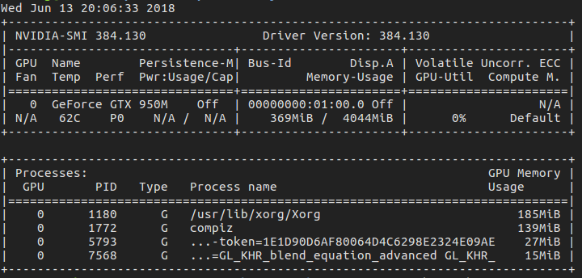
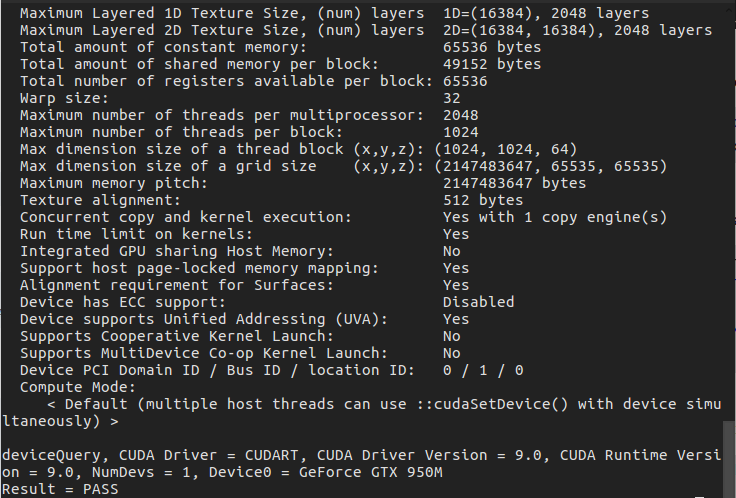

# AI-LAB3-Pytorch 
## Environments
* Ubuntu 16.04 LTS

* Nvidia-384.13

  ```shell
  sudo apt-get install libprotobuf-dev libleveldb-dev libsnappy-dev libopencv-dev libhdf5-serial-dev protobuf-compiler
  sudo apt-get install --no-install-recommends libboost-all-dev
  sudo apt-get install libopenblas-dev liblapack-dev libatlas-base-dev
  sudo apt-get install libgflags-dev libgoogle-glog-dev liblmdb-dev
  ```

  ```shell
  sudo apt-get remove --purge nvidia*
  sudo apt-get update
  ```
  > CTRL+ALT+F1

  ```shell
  sudo service lightdm stop
  sudo apt-get install nvidia-384
  nvidia-smi
  ```
  	

* CUDA 9.0

  Download .run from Web.

  ```shell
  sudo chmod a+u xxxx.run #x is what u download
  sudo ./xxxx.run
  ```

  Configure Path Variable

  ```shell
  sudo vim ~/.bsharc #:wq
  export PATH=/usr/local/cuda-9.0/bin:$PATH
  export LD_LIBRARY_PATH=/usr/local/cuda9.0/lib64:$LD_LIBRARY_PATH
  ```

  * Test example

    ```shel
    cd /usr/local/cuda-9.0/samples/1_Utilities/deviceQuery
    sudo make
    sudo ./deviceQuery
    ```

    

* cudnn 7